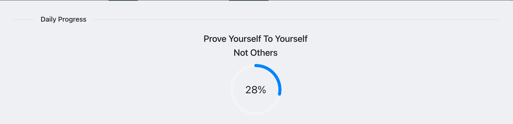
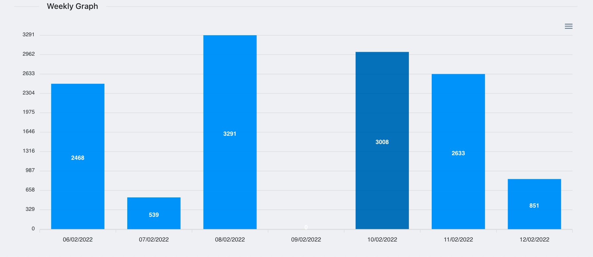
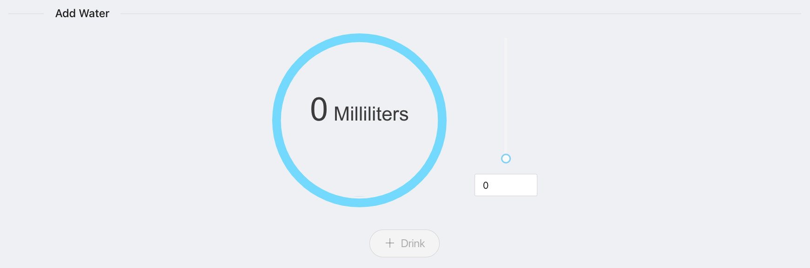

# Dripper
Water tracker using MERN development stack

## Usage
There are 3 sections inside the home page

### Daily Progress -

A gauge that tracks for the percentage of water the user entered since 00:00 the same day. Fills up live as the user enters more water below.

### Weekly Graph -

Graph displaying the amount of water the user entered since each day the last 7 days. Fills up the day's bar live as the user enters more water below.

### Drink -

Here you can enter the amount of water you drank, it accumulates in the sections above as mentioned and displays it. For convenience you can use the slider or enter a number on milliliters directly (up to 1000), the amount will show inside the gauge on the left.

## Server API Endpoints

user  - {_id, uid, name, email, photoURL, drinkHistory}
drink - {_id, userId, amount, timestamp}

Request             |         |                            |Response               |             |
--------------------|---------|----------------------------|-----------------------|-------------|
Route               |Method   |Body                        |Success                |Errors       |
--------------------|---------|----------------------------|-----------------------|-------------|
`/api/users`        |`GET`    |{}                          |[user, user, user, ...]|404, 500     |
`/api/users/:authId`|`GET`    |{}                          | user                  |404, 500     |
`/api/users/`       |`POST`   |{uid, name, email, photoURL}| user - 201            |400, 404, 500|
`/api/users/:id`    |`PUT`    |{}                          | user - 201            |400, 404, 500|
`/api/drinks?userId`|`GET`    |{}                          |[drink, drink, ...]    |404, 500     |
`/api/drinks/:_id`  |`GET`    |{}                          | drink                 |404, 500     |
`/api/drinks/`      |`POST`   |{userId, amount}            | drink - 201           |400, 404, 500|

## Build process

Run the full-build npm script, then the server script

`npm run full-build`

`npm run server`

This will start the server on port 9000 on your local machine

In order to run this repo on port 3000, add a .env file with `PORT=3000`

## Other Deployment Options

`npm run dev` - Run server and client separately in dev configuration

`npm run server` - Run only the server, will serve on / the last build client

## Technologies
`Back End`
- NodeJS
- Express
- MongoDB (Mongoose)

`Front End`
- ReactJS
- React Router
- Axios - API
- Ant Design - Layout and basic components
- ApexCharts
- React Liquid Gauge
- Browser Cookies - User authentication

`Services`
- Firebase - Google authentication
- Google Extensions - Site extension
- Chrome Alarm API - Extension notifications

